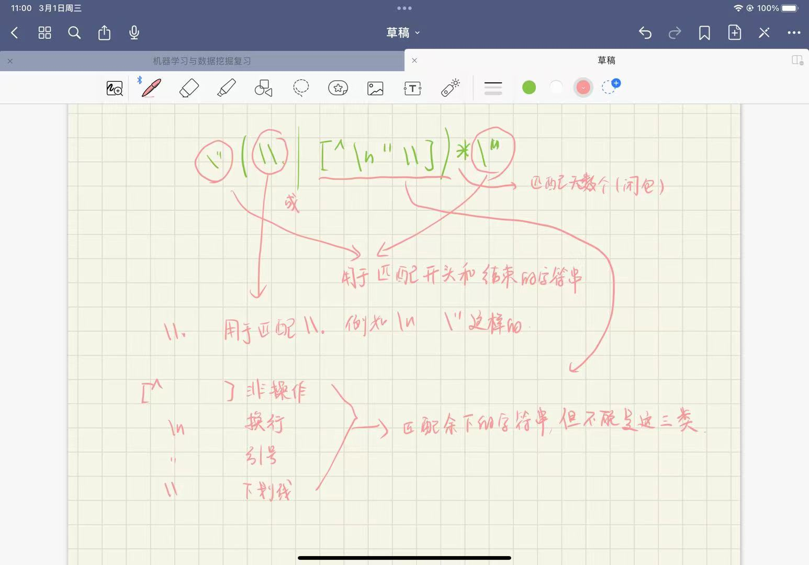

## 编译原理实验报告（1）

#### 实验任务：Lexer

#### 实现的token列表

```txt
token       name

const       const
,           comma
;           semi
int         int
[           l_square
]           r_square
=           equal
{           l_brace
}           r_brace
ident       identifier
(           l_paren
)           r_paren
void        void
if          if
else        else
while       while
break       break
continue    continue
return      return
intconst    numeric_constant
+           plus
-           minus
!           exclaim
*           star
/           slash
%           percent
<           less
>           greater
<=          lessequal
>=          greaterequal
==          equalequal
!=          exclaimequal
&&          ampamp
||          pipepipe
string      string_literal
char        char
do			do
long		long
float		float
```

#### 遇到的难点

1.字符常量的提取

字符常量的提取部分由于识别转义和一些特殊字符上面有困难，卡了很久。查阅了很多资料才解决，最后的结果导出很nice

正则表达式如下：

```
\"(\\.|[^\n"\\])*\"
```

解释：



2.数据常量

这一部分在代码中的呈现还是比较繁杂的，分别区分了int型，e结尾的科学计数法，p结尾的二进制科学计数法，以及十六进制与十进制的分别。 

这里暂时没有想到比较好的正则表达式去一条解决所有的问题，埋下一个坑看后续能不能继续改进

3.加入mid信息

准确来说这部分困难不是特别的大，但算是用了一些时间，整体的思路是从编译脚本那边获得的，定义了mid字符串用于存储信息，如果换行就是添加起始行提示，如果遇到间隔符就添加空格信息。

4.转义符

这个部分主要是不太熟悉的原因，有一些字符需要转义符，这个调试了一些时间并比对了正则表达式的规则得以解决。

#### 实验结果


分项时间：

