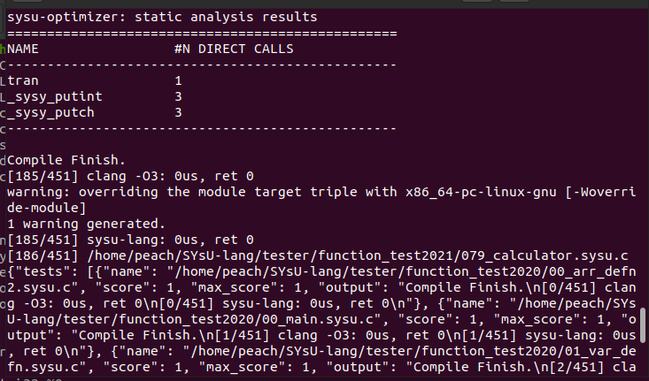
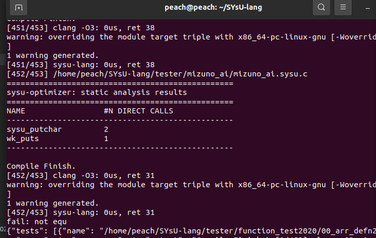

# IR生成

截至15日 还没有完成TT_TT ，只能是sry了

目前进度：



线上评测也遇到了问题

跳过的测例点：

2021：

006_arr_defn3.sysu.c 局部数组初始化问题

007_arr_defn4.sysu.c

068_genealogical_tree.sysu.c 未知错误


前面通过的测例点，内容上大概都是没问题的，基本每个ir我都和源代码的逻辑比对了。线上评测不知道问题是啥，改完框架后出的问题。

### 实验总结

由于实践快到了，感觉弄不完了，先做一波目前的成果汇报和总结，后续有推进在补充报告好了。 就这个实验个人感觉比前面实验二麻烦很多，主要的困难集中在： 

1. api查找，这个真的很花时间，就因为有很多输出的内容并不知道用什么接口比较好，就只能在llvm的头文件里面一个一个尝试，然后效率就很低，而且关于参数的类型也得一点一点的去查，这个工作效率就不太高，有一个比较经典的，就是我在做没有compound的if的时候，为了将这个问题全部归一化让代码复用，然后需要给json多加一层，然后这个过程就只能一点一点去找json的api去做，最后做出来了，但是花了很多的时间

```c++
          std::string key = "inner";
          std::vector<llvm::json::Value> V;
          V.push_back(ir);
          llvm::json::Object::KV a = {llvm::json::ObjectKey(key),V};
          std::initializer_list<llvm::json::Object::KV> x{a};
          auto tmp = llvm::json::Object(x);
```

2. 一些小bug的调试。由于我好像可能过于追求代码的复用，做到现在代码800多行挺精简的，但是这样子如果出现bug了，改正当前的可能会导致前面的也有问题，然后就要回调前面的。
3. 发现错误的过程，因为可能会遇到一些没输出的结果，然后就需要一点一点打断点去查，然后一些代码的ir量很大，就花了很长的时间


其实目前的过程中其他的小困难还有很多，就目前整个做过来的过程一直比较坎坷，然后就自己的代码能力一直有问题感觉，越写越觉得说自己代码写的好烂，中间也重构了几次，然后拖到了现在。没写完感觉就是说，可能一开始架构的设计就有问题，可能像官网文档那样弄成类会更好一点？ 就目前来看就没啥办法，回又回不去，只能硬着头皮往下调TT_TT


就关于实验框架，就我感觉wiki上的提示确实比前面两个实验少太多了，不过这个确实是可以自己学习的过程，然后可能我比较菜，就进行的很慢，然后就真的做不完了。目前阶段应该主要要总结的内容就是这样。

希望后续能够嘎嘎解决bug吧


2023.5.23更新

目前的进度已经基本完成本地的能够评测的测例

只剩下一个测例 80_chaos_token.sysu.c还在排查问题，初步判定为赋值0太多的问题

评测机的问题一直无法解决，也和助教沟通了，目前还没有获得解决方案TT_TT

结果截图如下：



2023.5.30 

完成本地所有的测例，正在调试评测姬TT_TT


2023.6.2

评测机问题解决，主要是llvm版本更新导致的常量更新和create函数Align的创建无法实现

最终结果目前是24%的性能，效果还不错，同时还为添加相关的代码优化


